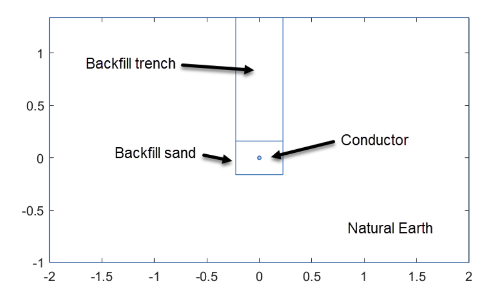

# Optimisation of Current Carrying Cables
## Introduction
This demonstration shows a combination of:

1. Finite element analysis (FEA) of solid body heat transfer with non-linear material properties
1. Optimisation of an output of the FEA

specifically related to a real world problem.  We walk through the general process, which is:

1. Generate a representative FEA solver wrapped into a function
1. Use Surrogate Optimisation to find a close, but fast, approximation of the global optimum
1. Deploy a local solver based on the output of the Surrogate Optimisation to polish and find the global optimum 

We will look at the case of a current carrying conductor that is buried underground.  In this case we want to maximise the current that can be carried subject to the insulator staying below a fixed temperature.  See the domain sketch below.

## Requirements
We use the following tools within this demonstration:

1. MATLAB (≥2020b), see note below
1. Partial Differential Equation Toolboc
1. Optimisation Toolbox
1. Global Optimisation Toolbox
1. Parallel Computing Toolbox

The demonstration will work with versions of MATLAB earlier than 2020b but as we are using the Optimsation Live Task that is released in 2020b those sections will be limited to code only.

## Getting Started
Open the project file, conductorOptimisation.prj, which will in turn configure the environment and launch a number of live scripts into the editor.  Start with the script: demonstrationOverview.mlx.

## Copyright

Copyright © 2020 The MathWorks, Inc.